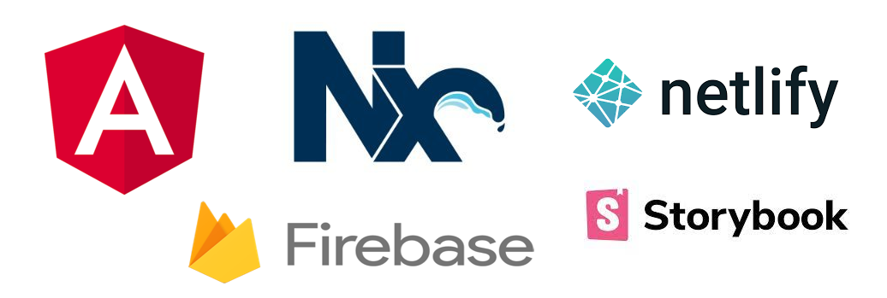

# Angular PWA(Progressive Web Application)

A simple Angular PWA Application which includes following PWA features:-
- Offline Mode
- Installable
- App like experience
- Push notifications
- Automatic updates
- Security

## Tech stack

    

- [Angular 12][angular]
- [Nx Workspace][nx]
- [Netlify (for deployment)][netlify]

[angular]: https://angular.io/
[nx]: https://nx.dev/
[netlify]: http://netlify.com/

## Connect With Me:

&nbsp;&nbsp;

&nbsp;&nbsp;

&nbsp;&nbsp;

## License
Feel free to use this code on your project. Please put a reference to this repository.

[MIT](https://opensource.org/licenses/MIT)
